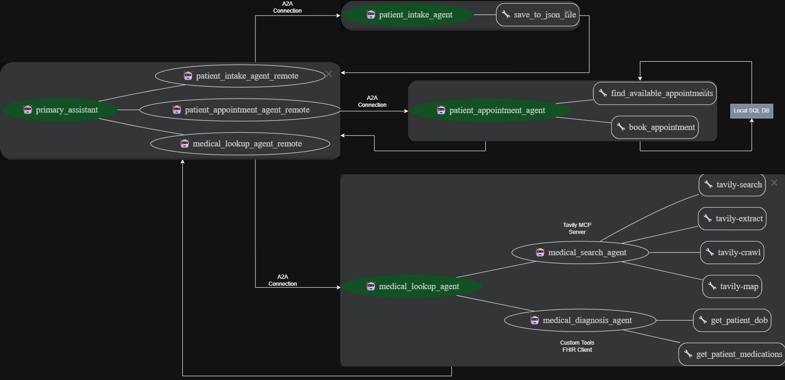

# PatientDeskAgent-AI
**Automated front-desk assistant for healthcare — scheduling appointments, patient registration, and fetching medication data via agents.**

## 🎯 Problem & Motivation

Patient front-desks in clinics/hospitals handle a lot of routine but critical tasks:  
- scheduling appointments,  
- registering new patients,  
- fetching patient medication details,  
- answering common queries about medicines.

These tasks are repetitive, time-consuming, and often involve switching between multiple systems (hospital database, FHIR servers, medication info services).  

**PatientDeskAgent-AI** aims to automate and streamline these front-desk operations — reducing manual overhead, minimizing errors, and enabling healthcare staff to focus on patient care rather than administrative overhead.

## 💡 Solution Overview

PatientDeskAgent-AI uses a multi-agent architecture to automate common front-desk tasks:

- **Appointment Agent**: schedules new appointments and checks existing ones.  
- **Medication Agent**: fetches a patient’s medication history using FHIR (based on patient ID), and — via a Tavily MCP server — obtains detailed information about medicines on demand.  
- **Patient Intake Agent**: registers new patients; stores the registration details (e.g. demographics, contact info) in an `output/` folder.  
- **Primary Agent**: acts as an orchestrator. It receives user queries and delegates tasks to the appropriate agent (Appointment, Medication, or Patient Intake) using an agent-to-agent (A2A) communication protocol.  

All subordinate agents (Appointment, Medication, Patient Intake) run remotely; they communicate with the Primary Agent over the A2A protocol. This decoupled, agent-based design makes the system modular, extensible, and easier to maintain or scale (e.g. adding more agents in future).

## 🏗 Architecture / Design



- Primary Agent routes user requests/queries.  
- Sub-agents handle domain-specific tasks.  
- Remote communication — enables each sub-agent to operate independently.  
- Data (like patient info or appointment logs) output to local `output/` folder or returned to user as responses.

## ✅ Features / Capabilities

- Schedule new appointments or look up existing appointments.  
- Register new patients — storing their info for later reference.  
- Fetch patient’s medication history (via FHIR) given their ID.  
- On-demand retrieval of medicine information from an external medicine-info server (Tavily MCP).  
- Modular architecture: new agents (e.g. billing, lab-results, reminders) can be added easily.

## ✅ Feature Inculded in Agent

- Multi-Agent system: Agent powered by an LLM
- Tools: MCP, custom tools
- Session & Memory: Sessions & state management (e.g. InMemorySessionService)
- Context engineering
- Observability: Logging, Tracing
- Agent evaluation
- A2A Protocol

## 🚀 Quick Start — Setup & Run

### Prerequisites

- Docker & Docker Compose installed  
- Access to required remote services (FHIR server, Tavily MCP server)  
- Appropriate credentials / configuration: Google_API_KEY and Tavily_API_KEY. Example .env file is present in repo with name example.env.txt

### Build & Start

```bash
git clone https://github.com/adi7820/PatientDeskAgent-AI.git
cd PatientDeskAgent-AI

# Build and run all agents & services
docker compose up --build
```